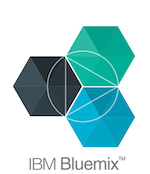

# IBM Cloud Advisor 101 Course




## Cohort 2016-03-14

### Schedule
  - Monday: 8am - 5pm (Breakfast and Lunch served)
  - Tuesday - Friday: 9am - 5pm
  - Friday: 5pm (Hosted Happyhour on Rooftop)

### Syllabus

#### Arrive & Setup
  - Meet & Greet + Breakfast
  - Get on Network (g|events -> machinelearning)

#### Introductions
  - Roll Call, Verify Emails
  - Students
  - Instructor
  - About Galvanize, http://www.galvanize.com/
  - Course Overview

#### Bluemix Garage
  - https://www.ibm.com/cloud-computing/bluemix/garage/
  - Presentation
  - Design Thinking

#### Assessment
  - Technical
  - Cloud
  - Agile

#### Cloud 9 Setup
  - https://c9.io/
  - Create a Custom Ubuntu Workspace
  - Open Terminal

```sh
$ rm README.md
$ wget https://raw.githubusercontent.com/chyld/devops/master/c9-setup.sh
$ chmod +x c9-setup.sh
$ ./c9-setup.sh
$ rm c9-setup.sh
$ vi ~/.gitconfig
$ exit
```

#### Modern Programming Fundamentals
  - JavaScript
  - Node.js, https://nodejs.org/en/
  - Pair Programming
  - Test Driven Development
  - Git
  - JazzHub

| Project | Description |
| ------------- | ------------- |
| `add(1,2)`  | Add 2 numbers, compute sum|
| `sub(3,5)`  | Subtract 2 numbers, find difference |
| `square(2)` | Square a number |
| `factorial(5)` | Compute factorial |
| `distance(p1, p2)` | Compute distance between 2 points on a plane |
| `roll(6)` | Roll a random n-sided die |
| `sum([3,5,7])` | Sum an array of values |
| `squareOdds([1,2,3,4,5])` | Return an array of squared odd values |

#### Back End Services
  - HTTP
  - Express.js, http://expressjs.com/
  - Async Programming

#### IBM Bluemix DevOps Services
  - https://hub.jazz.net/
  - JazzHub
  - Code Editor
  - Track & Plan
  - Build Pipeline

#### Front End Technologies
  - Browser
  - Angular, JavaScript MVC Framework, https://angularjs.org/
  - Twitter Bootstrap CSS Framework, http://getbootstrap.com/
  - Build Tools, Gulp

#### Full Stack Applications
  - Front End
  - Back End
  - API Consumption

#### NodeRED
  - http://nodered.org/
  - Create Application on Bluemix

#### Cloud Foundry
  - https://www.cloudfoundry.org/
  - CLI
  - Deploy from Command Line
  - Create Services
  - Bind Services
  - View Marketplace
  - View Application Credentials
  - Scale up or Down App Instances

#### Projects

#### Hackathon
  - http://bluemixathon.devpost.com/
  - https://vimeo.com/137915648
  - http://www.linkedin.com/pulse/so-you-want-run-corporate-hackathon-vinod-ralh
  - Split into groups of 3 or 4
  - Each team build an application using Bluemix services and deploys using DevOps services
  - At the conclusion of the hackathon, each team demos their app to the class

#### Retrospective

#### Feedback
  - https://docs.google.com/a/galvanize.com/forms/d/1jRT3EE_acCe_V8iWA77nU8sdqhbBmIiHUsAiMVQt4Eo/viewform

#### Tour
  - Galvanize
  - Full Stack Classrooms
  - Data Science Classrooms
  - Bluemix Garage
  - Cloudant
  - Startups

#### Happy Hour on Roof
